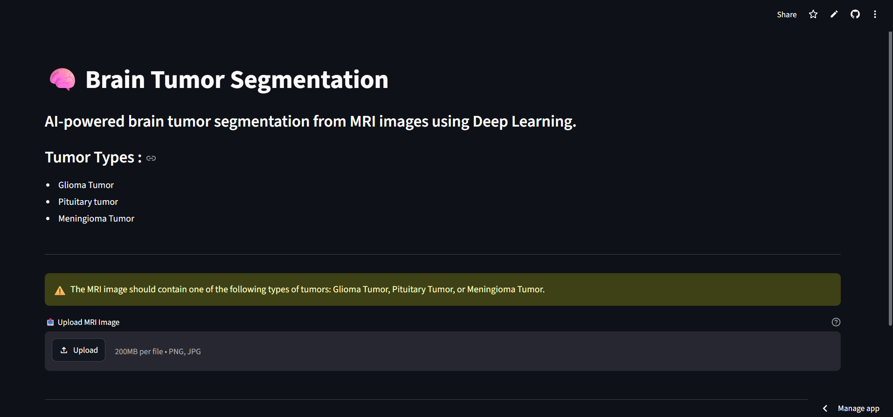
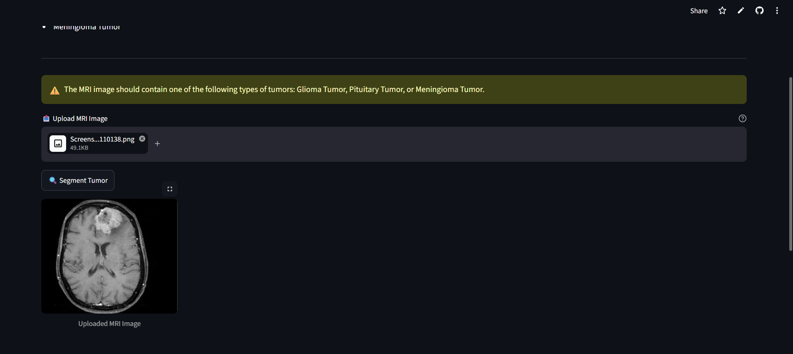
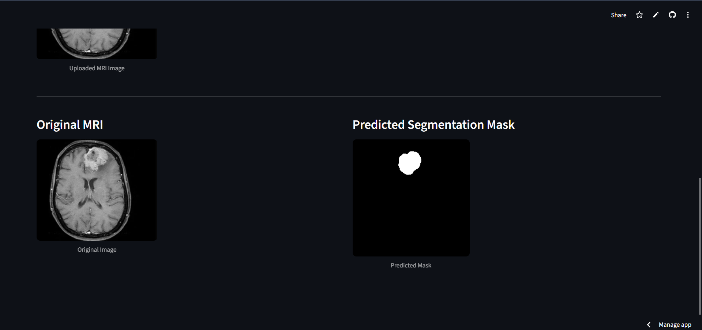

# 🧠 Brain Tumor Segmentation

[](https://brain-tumor-segmentation-app-3bgwsdk9vxxy9vvrvdadui.streamlit.app/)

AI-powered web application for **automatic brain tumor segmentation from MRI images**, built with **Deep Learning (U-Net + ResNet34 encoder)** and deployed with **Streamlit**.

The app takes a single MRI slice as input and returns a **binary segmentation mask** highlighting the tumor region, allowing quick visual inspection of the affected area.

🔗 **Live App:** [brain-tumor-segmentation-app.streamlit.app](https://brain-tumor-segmentation-app-3bgwsdk9vxxy9vvrvdadui.streamlit.app/)

---

## 🩺 Supported Tumor Types

The model was trained to detect and segment the following tumor types from MRI scans:

- **Glioma Tumor**
- **Meningioma Tumor**
- **Pituitary Tumor**

> ⚠️ The uploaded MRI image must contain one of the tumor types above for the model to produce a meaningful segmentation mask.

---

## 🚀 Demo

The app is live and deployed on **Streamlit Cloud** → **[Try it here](https://brain-tumor-segmentation-app-3bgwsdk9vxxy9vvrvdadui.streamlit.app/)**

Below is a walkthrough of the app in action:

### 1. Upload an MRI Image


### 2. Preview the Uploaded Image


### 3. Run Segmentation and View the Result
The app displays the **original MRI** side-by-side with the **predicted segmentation mask**:



---

## ⚙️ How It Works

```
MRI Image (PNG/JPG)
        ↓
Preprocessing (Grayscale → Resize 256x256 → 3-channel → Normalize)
        ↓
U-Net Model (ResNet34 Encoder) — loaded from Hugging Face Hub
        ↓
Binary Segmentation Mask (Tumor Region)
        ↓
Streamlit UI (Original Image + Predicted Mask side-by-side)
```

1. **Image Upload** — the user uploads a 2D MRI slice (PNG/JPG/JPEG).
2. **Preprocessing** — the image is converted to grayscale, resized to `256x256`, expanded to 3 channels, and normalized using the same preprocessing function as the model's encoder (`resnet34`).
3. **Prediction** — the preprocessed image is passed to a pretrained **U-Net segmentation model**, downloaded automatically from the Hugging Face Hub at runtime (no need to bundle large model weights in the repo).
4. **Postprocessing** — the raw prediction is thresholded (`> 0.5`) to produce a binary mask.
5. **Visualization** — the original MRI and the predicted mask are displayed side-by-side in the Streamlit interface.

---

## 🧬 Model

| Detail | Value |
|---|---|
| Architecture | U-Net |
| Encoder (Backbone) | ResNet34 (pretrained) |
| Framework | TensorFlow / Keras (`segmentation_models` library) |
| Input Size | 256 x 256 x 3 |
| Output | Binary segmentation mask |
| Hosting | [Hugging Face Hub](https://huggingface.co/abdollah111/brain-tumor-segmentation) |

The model weights are **not stored in this repository**. Instead, they are pulled at runtime via `huggingface_hub.hf_hub_download`, which keeps the repository lightweight and avoids Git LFS limitations.

---

## 📊 Dataset

The model was trained on an MRI brain tumor dataset containing labeled slices for the three tumor classes mentioned above (Glioma, Meningioma, Pituitary), each paired with a ground-truth segmentation mask.

> 📌 **Note:** A detailed Exploratory Data Analysis (EDA) — including class distribution, sample counts per tumor type, and image size statistics — is planned to be added here once the training notebook is published.

---

## 🛠️ Tech Stack

- **Python**
- **Streamlit** — web app interface
- **TensorFlow / Keras** — deep learning model
- **segmentation_models** — U-Net implementation with pretrained encoders
- **OpenCV** — image preprocessing
- **Hugging Face Hub** — model hosting & download

---

## 💻 Run Locally

```bash
# 1. Clone the repository
git clone https://github.com/abdollahDraz/brain-tumor-segmentation-streamlit.git
cd brain-tumor-segmentation-streamlit

# 2. Install dependencies
pip install -r requirements.txt

# 3. Run the Streamlit app
streamlit run app.py
```

The app will open automatically in your browser at `https://brain-tumor-segmentation-app-3bgwsdk9vxxy9vvrvdadui.streamlit.app/`.

---

## 📁 Project Structure

```
brain-tumor-segmentation-streamlit/
├── app.py              # Main Streamlit application
├── requirements.txt    # Python dependencies
├── assets/             # Demo screenshots used in this README
└── README.md
```

---

## 📜 License

This project is for **research and educational purposes**. Not intended for clinical or diagnostic use.

---

## 🙏 Acknowledgements

- [segmentation_models](https://github.com/qubvel/segmentation_models) library for the U-Net + ResNet34 implementation.
- [Hugging Face Hub](https://huggingface.co/) for model hosting.
